# 🏗️ PDB2JSON Architecture & System Design

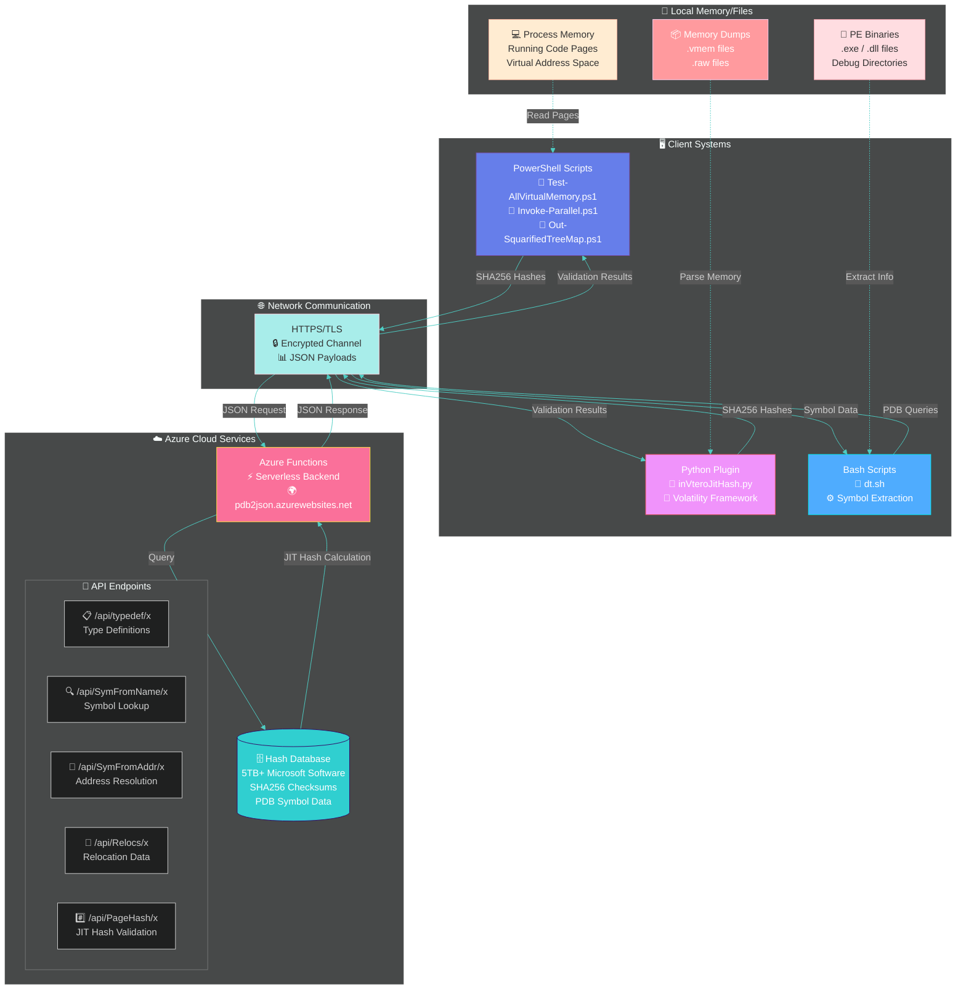

**⚡ Serverless · 🔒 Secure · 🚀 Scalable · 🆓 Free**

---

## 📊 System Overview

The PDB2JSON system is a **cloud-native memory integrity validation platform** that combines:

- 🎯 **Just-In-Time (JIT) Hashing** - Dynamic hash calculation based on client's virtual address
- 🔐 **Privacy-First Design** - Only SHA256 hashes transmitted (no binary data)
- 🌐 **Global Scale** - Azure Functions serverless architecture
- 📚 **Massive Coverage** - 5TB+ of Microsoft software pre-indexed

---

## 🔄 Data Flow Architecture

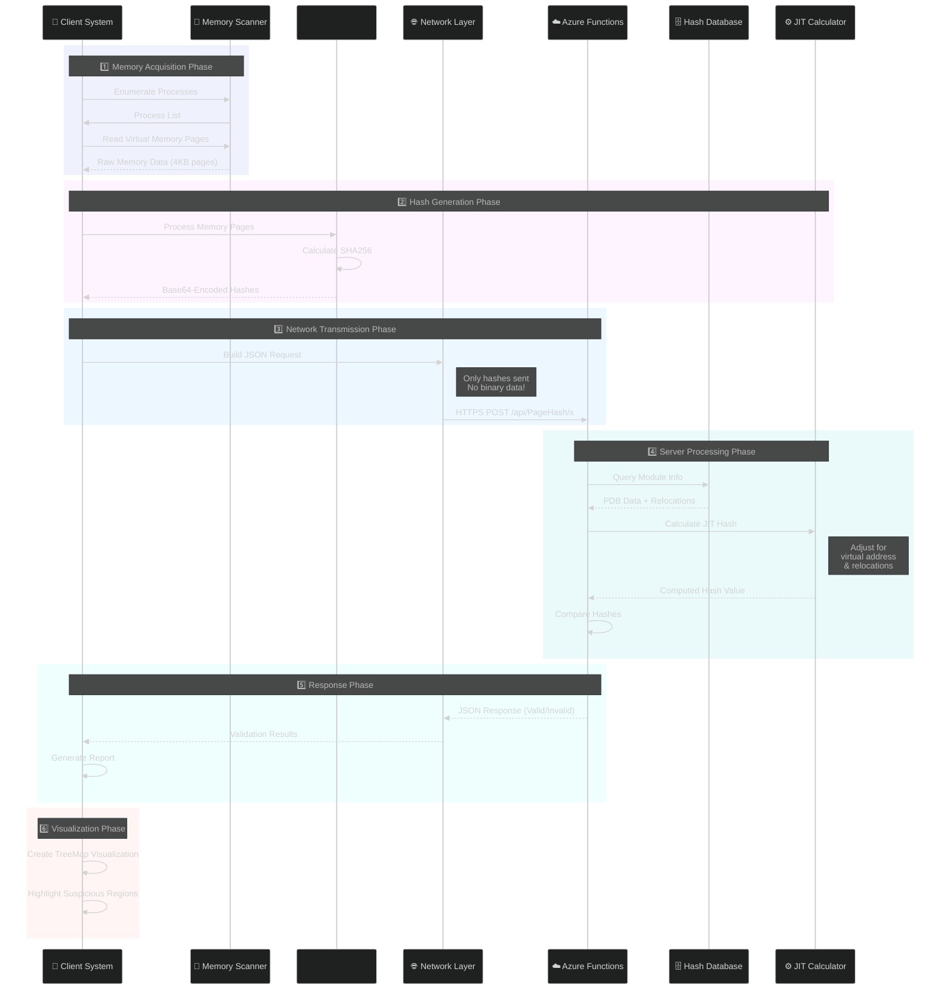

---

## 🎯 Component Deep Dive

### 1️⃣ PowerShell Client Layer

```mermaid
%%{init: {'theme':'dark', 'themeVariables': { 'primaryColor':'#f093fb','primaryTextColor':'#fff','primaryBorderColor':'#f5576c','lineColor':'#4facfe','secondaryColor':'#30cfd0'}}}%%
graph LR
    subgraph "🔷 Test-AllVirtualMemory.ps1"
        A[Process<br/>Enumeration] --> B[Memory<br/>Reading]
        B --> C[SHA256<br/>Hashing]
        C --> D[JSON<br/>Serialization]
    end
    
    subgraph "🔷 Invoke-Parallel.ps1"
        E[Runspace<br/>Pool] --> F[Thread<br/>Management]
        F --> G[Parallel<br/>Execution]
    end
    
    subgraph "🔷 Out-SquarifiedTreeMap.ps1"
        H[Data<br/>Processing] --> I[TreeMap<br/>Algorithm]
        I --> J[WPF<br/>Rendering]
    end
    
    D --> E
    G --> H
    
    style A fill:#f093fb,stroke:#f5576c,color:#fff
    style B fill:#f093fb,stroke:#f5576c,color:#fff
    style C fill:#f093fb,stroke:#f5576c,color:#fff
    style D fill:#f093fb,stroke:#f5576c,color:#fff
    style E fill:#4facfe,stroke:#00f2fe,color:#fff
    style F fill:#4facfe,stroke:#00f2fe,color:#fff
    style G fill:#4facfe,stroke:#00f2fe,color:#fff
    style H fill:#30cfd0,stroke:#330867,color:#fff
    style I fill:#30cfd0,stroke:#330867,color:#fff
    style J fill:#30cfd0,stroke:#330867,color:#fff
```

**Key Features:**
- 🔄 **Parallel Processing**: Up to 512 concurrent threads
- 🎨 **Rich Visualization**: Interactive TreeMap with heat mapping
- 🔐 **Privilege Escalation**: Optional SYSTEM-level access
- 🌐 **Remote Scanning**: PSRemoting for network-wide deployment

### 2️⃣ Python Volatility Plugin

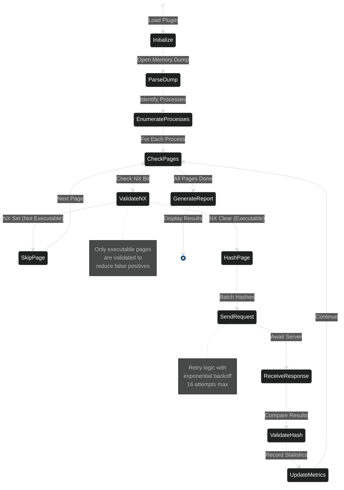

**Advanced Features:**
- 🔍 **NX Bit Awareness**: Only validates executable pages
- 🎨 **Color-Coded Output**: ANSI terminal support
- 📊 **Progress Tracking**: Real-time tqdm progress bars
- 🔄 **Retry Logic**: Robust error handling with backoff

### 3️⃣ Bash Symbol Extraction

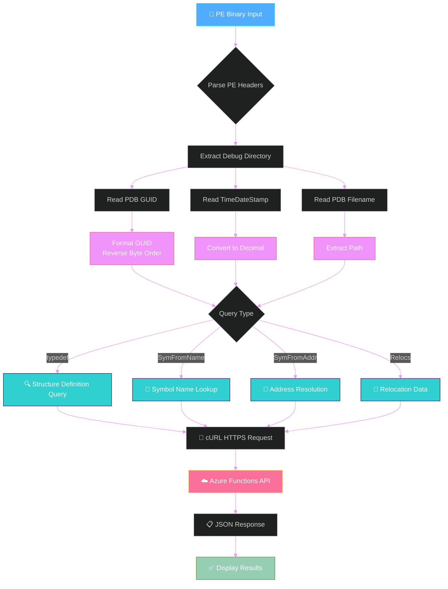

---

## 🔐 Security Architecture

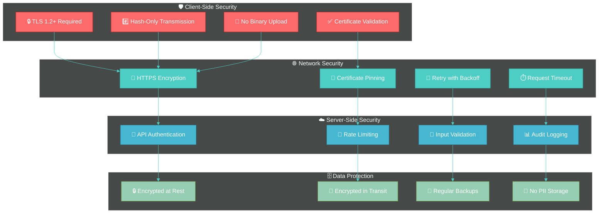

### 🔑 Security Principles

1. **🚫 Privacy by Design**: No binary data ever leaves client
2. **🔒 Defense in Depth**: Multiple security layers
3. **✅ Verify Always**: Certificate and signature validation
4. **📊 Audit Trail**: Comprehensive logging and monitoring

---

## ⚡ Performance Optimization

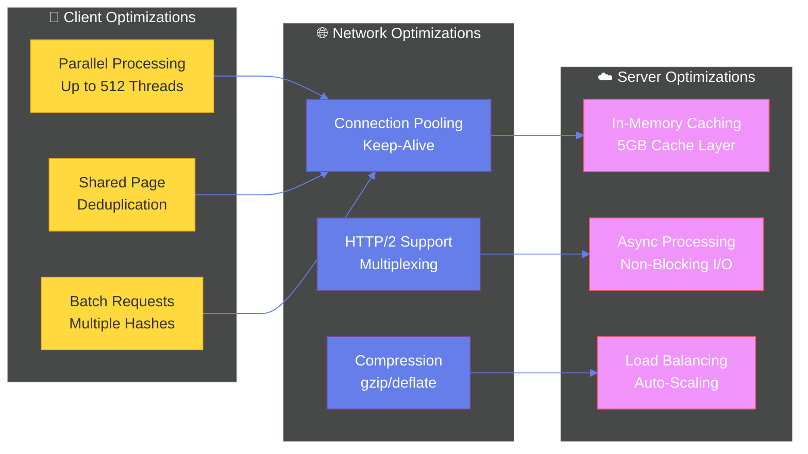

### 📊 Performance Metrics

| Component | Throughput | Latency | Concurrency |
|-----------|-----------|---------|-------------|
| 💾 Memory Read | ~100 MB/s | <1ms | N/A |
| #️⃣ Hash Generation | ~500 MB/s | <1ms | Multi-core |
| 🌐 Network Request | Varies | 50-200ms | 512 parallel |
| ☁️ Server Processing | 10K req/s | <50ms | Auto-scale |

---

## 🎨 Visualization Layer

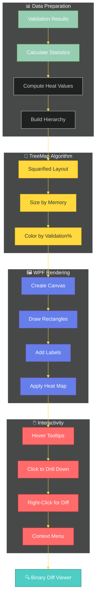

### 🎨 Color Coding Scheme

| Validation % | Color | Meaning |
|-------------|-------|---------|
| 100% | 🟦 Blue | ✅ Fully Validated |
| 80-99% | 🟩 Green | ⚠️ Mostly Valid |
| 60-79% | 🟨 Yellow | ⚠️ Some Issues |
| 40-59% | 🟧 Orange | 🚨 Multiple Issues |
| 20-39% | 🟥 Red | 🚨 Serious Issues |
| <20% | 🟪 Purple | 💀 Critical Issues |

---

## 🔬 JIT Hashing Explained

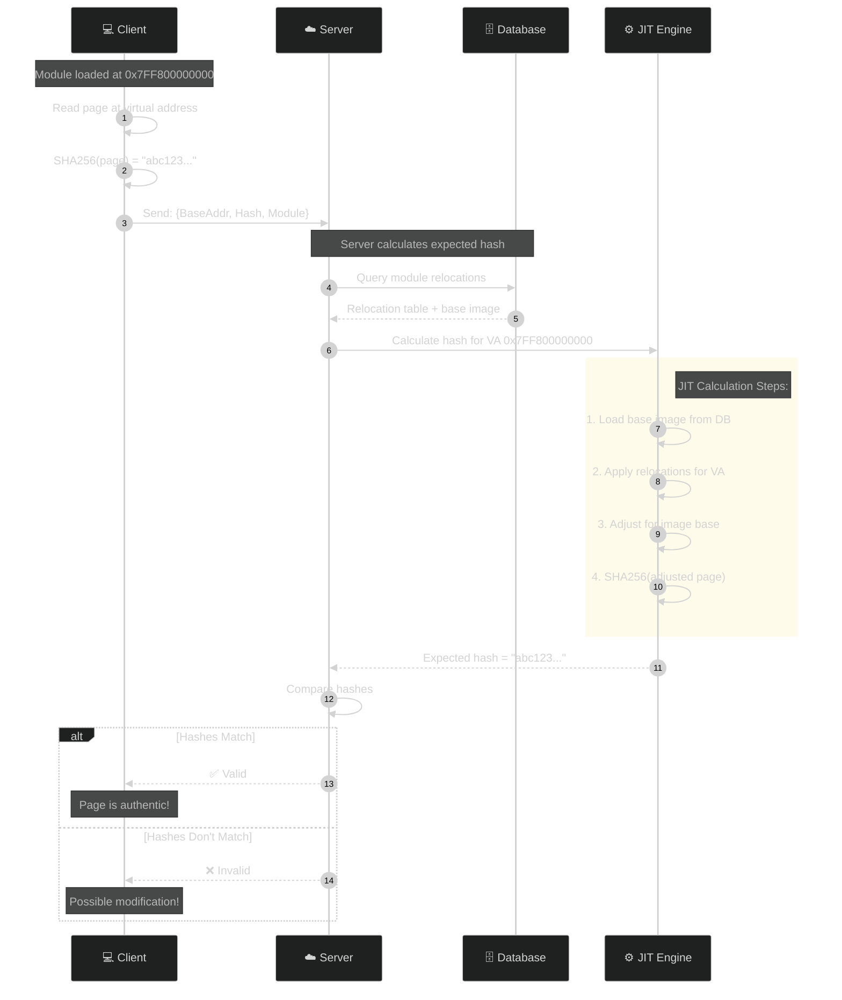

### ⚙️ Why JIT Hashing?

**Traditional Approach** ❌
- Pre-compute hashes for every possible load address
- Storage: ~100TB for Windows alone
- Inflexible: New addresses = recalculate everything

**JIT Approach** ✅
- Calculate hashes on-demand
- Storage: ~5TB base images + relocations
- Flexible: Works for any load address instantly

---

## 📈 Deployment Architecture

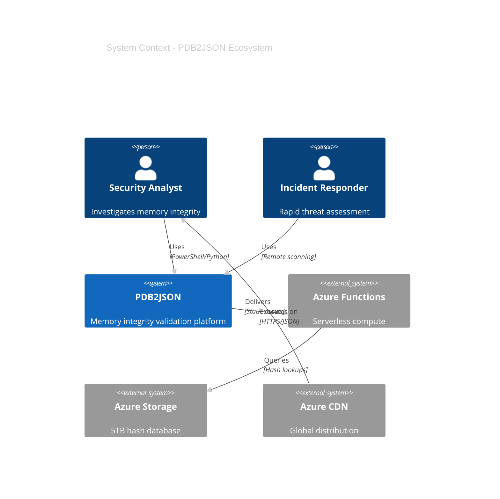

---

## 🚀 Future Enhancements

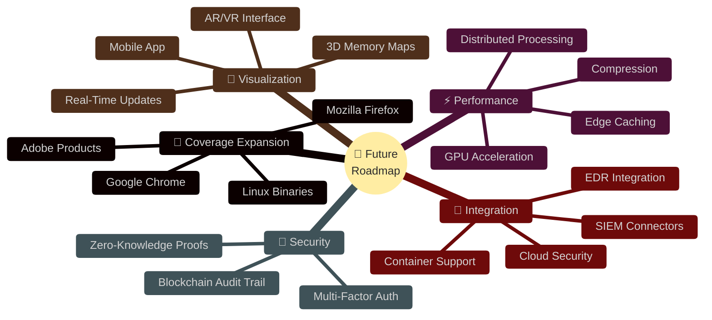

---

## 📚 Additional Resources

- 📖 [Quick Start Guide](QUICKSTART.md)
- 🤝 [Contributing Guide](CONTRIBUTING.md)
- 💡 [Examples](examples/README.md)
- 🔗 [GitHub Repository](https://github.com/K2/Scripting)
- ☁️ [Azure Functions Docs](https://docs.microsoft.com/azure/azure-functions/)

---

**Made with 💙 by the Security Community**

*"Because memory integrity matters"*

