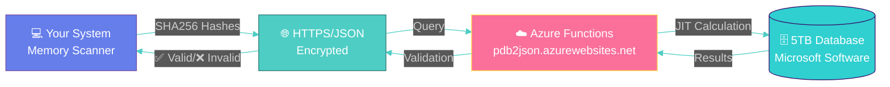
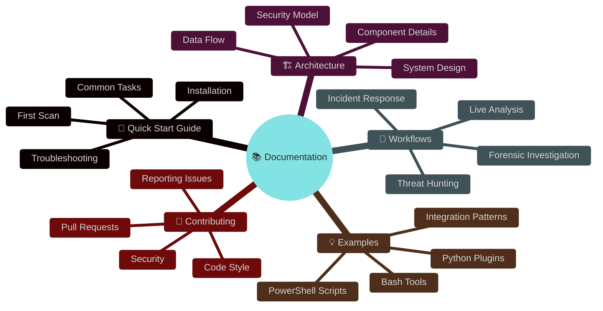
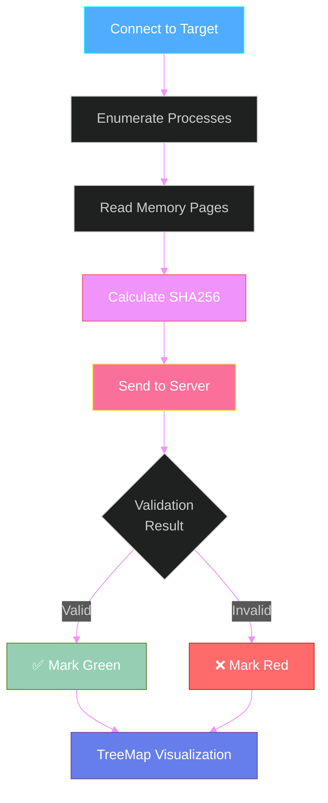
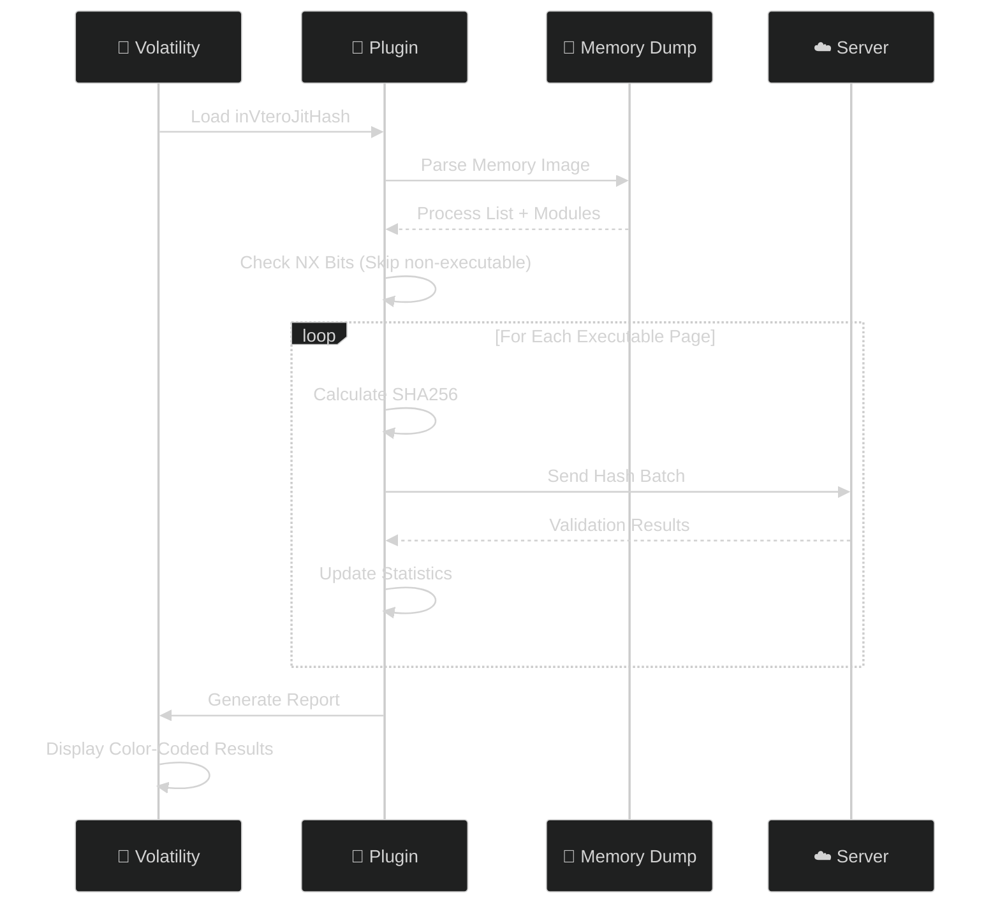
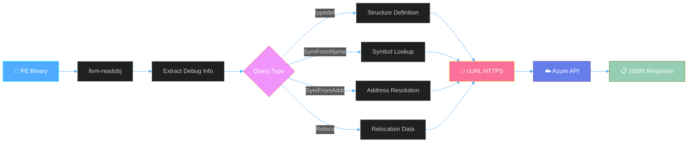
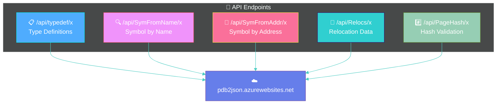
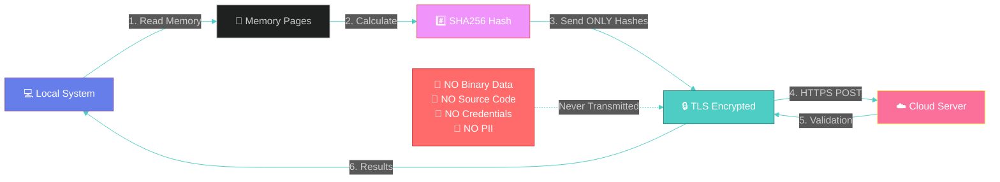

# 🔐 PDB2JSON Scripting Examples

<div align="center">

[](LICENSE)
[](https://azure.microsoft.com/services/functions/)
[](https://docs.microsoft.com/powershell/)
[](https://www.python.org/)

**The world's largest hash database for memory integrity validation** 🌍

[Quick Start](QUICKSTART.md) · [Architecture](ARCHITECTURE.md) · [Workflows](WORKFLOWS.md) · [Examples](examples/) · [Contributing](CONTRIBUTING.md)


</div>

---

## 🎯 What is PDB2JSON?

PDB2JSON is an **Azure Functions-based application** that provides memory integrity validation through **Just-In-Time (JIT) hashing**. This repository contains scripts and tools that interface with the cloud-hosted Code+PDB analysis server.



### ✨ Key Features

| Feature | Description |
|---------|-------------|
| 🔒 **Privacy-First** | Only SHA256 hash values transmitted - **no binary data uploaded** |
| ⚡ **JIT Hashing** | Dynamic hash calculation for any virtual address |
| 🌍 **Massive Scale** | 5TB+ of Microsoft software pre-indexed |
| 🆓 **Free & Unlimited** | No cost, no rate limits, fully accessible |
| 🔐 **Secure** | TLS encryption, certificate validation |
| 🚀 **High Performance** | Parallel processing up to 512 threads |

---

## 🚀 Quick Start

### 30-Second Setup

```bash
# Clone the repository
git clone https://github.com/K2/Scripting.git
cd Scripting

# For PowerShell users
Install-Module ShowUI -Scope CurrentUser

# For Python users (Volatility plugin)
pip install -r requirements.txt

# For Bash users
# Ensure llvm-readobj and curl are installed
```

### First Scan (PowerShell)

```powershell
# Basic remote memory scan
.\Test-AllVirtualMemory.ps1 `
    -TargetHost "192.168.1.100" `
    -aUserName "Administrator" `
    -aPassWord "YourPassword" `
    -GUIOutput
```

### First Analysis (Python/Volatility)

```bash
# Analyze a memory dump
python vol.py --plugins=. -f memory.vmem \
    --profile=Win10x64_14393 invterojithash
```

### First Symbol Lookup (Bash)

```bash
# Extract structure definition
./dt.sh -i ntoskrnl.exe -t _EPROCESS
```

👉 **For detailed setup instructions, see [QUICKSTART.md](QUICKSTART.md)**

---

## 📚 Documentation

We've created comprehensive documentation to help you get started:



| Document | Description |
|----------|-------------|
| 📖 [QUICKSTART.md](QUICKSTART.md) | Get started in 5 minutes with step-by-step examples |
| 🏗️ [ARCHITECTURE.md](ARCHITECTURE.md) | Deep dive into system architecture and design |
| 🔄 [WORKFLOWS.md](WORKFLOWS.md) | Common workflows and process guides |
| 💡 [examples/](examples/) | Ready-to-use example scripts and templates |
| 🤝 [CONTRIBUTING.md](CONTRIBUTING.md) | Guidelines for contributing to the project |

---

## 🛠️ Tools & Scripts

### PowerShell Scripts

#### 🔷 Test-AllVirtualMemory.ps1
**Remote memory integrity scanning and validation**

Remotely scans all virtual memory in a target system and validates it against the hash database.



**Key Features:**
- 🌐 Remote scanning via PSRemoting
- 🔄 Parallel processing (up to 512 threads)
- 🎨 Interactive TreeMap visualization with heat mapping
- 🔐 Optional SYSTEM-level privilege escalation
- 💾 Binary diff viewer for modified pages

**Example Usage:**
```powershell
# Comprehensive scan with GUI
.\Test-AllVirtualMemory.ps1 `
    -TargetHost "Server2016" `
    -aUserName "admin" `
    -aPassWord "password" `
    -MaxThreads 256 `
    -ElevatePastAdmin `
    -GUIOutput

# Filter specific processes
.\Test-AllVirtualMemory.ps1 `
    -TargetHost "192.168.1.100" `
    -aUserName "admin" `
    -aPassWord "pass" `
    -ProcNameGlob @("chrome.exe", "iexplore.exe") `
    -GUIOutput
```

#### 🔷 Invoke-Parallel.ps1
**High-performance parallel processing framework**

Enables concurrent execution of script blocks across multiple runspaces for maximum performance.

**Features:**
- ⚡ Up to 512 concurrent threads
- 🔄 Automatic runspace management
- 📊 Progress tracking and logging
- ⏱️ Timeout and retry handling
- 💾 Memory-efficient batching

#### 🔷 Out-SquarifiedTreeMap.ps1
**Advanced data visualization with TreeMap algorithm**

Creates interactive squarified TreeMap visualizations with heat mapping for memory validation results.

**Features:**
- 🎨 Squarified layout algorithm
- 🌈 Heat map color coding
- 🖱️ Interactive tooltips and drill-down
- 📊 Size by memory, color by validation percentage
- 🔍 Binary diff viewer on right-click

---

### Python Tools

#### 🐍 inVteroJitHash.py
**Volatility Framework plugin for memory dump analysis**

Validates memory dumps against the PDB2JSON hash database using the Volatility Framework.



**Key Features:**
- 🔍 NX-bit aware validation (only executable pages)
- 🎨 ANSI color-coded terminal output
- 📊 Real-time progress bars (tqdm)
- 🔄 Retry logic with exponential backoff
- 💾 Optional failed block dumping
- 📝 Comprehensive logging

**Example Usage:**
```bash
# Basic scan
python vol.py --plugins=. -f memory.vmem \
    --profile=Win10x64_14393 invterojithash

# Advanced scan with extra details
python vol.py --plugins=. -f suspicious.raw \
    --profile=Win7SP1x64 invterojithash \
    -x -s -D /output/failed -F failures.txt
```

**Command-Line Options:**
- `-x, --ExtraTotals`: Display per-module statistics
- `-s, --SuperVerbose`: Show per-page validation details
- `-D, --DumpFolder`: Directory to dump failed blocks
- `-F, --FailFile`: Output file for failure details

---

### Bash Scripts

#### 🐚 dt.sh
**Symbol extraction and PDB query tool**

Extract JSON symbol information from Windows binaries without downloading PDB files.



**Example Usage:**
```bash
# Get structure definition
./dt.sh -i ntoskrnl.exe -t _EPROCESS

# Find symbols by name pattern
./dt.sh -i kernel32.dll -X "CreateFile*"

# Resolve symbol at address
./dt.sh -i ntdll.dll -A 0x1400

# Extract relocations
./dt.sh -i app.exe -r -o relocations.bin
```

**Command-Line Options:**
- `-i FILE`: Input PE file (required)
- `-t TYPE`: Type definition query (_EPROCESS, etc.)
- `-X PATTERN`: Symbol name with wildcards
- `-A ADDR`: Address to resolve
- `-r`: Get relocation data
- `-b BASE`: Optional base virtual address
- `-o FILE`: Output file

---

## 🌐 Server API Endpoints

The PDB2JSON server provides several REST API endpoints:



### 📋 typedef - Type Definitions

Get JSON-formatted structure definitions for automatic profile generation.

**Endpoint:** `https://pdb2json.azurewebsites.net/api/typedef/x`

**Use Cases:**
- Volatility/Rekall profile generation
- inVtero.net automation
- Structure reverse engineering

### 🔍 SymFromName - Symbol Lookup

Returns symbol information based on name (e.g., `_EPROCESS`).

**Endpoint:** `https://pdb2json.azurewebsites.net/api/SymFromName/x`

### 📍 SymFromAddr - Address Resolution

Returns the symbol located at the specified virtual address.

**Endpoint:** `https://pdb2json.azurewebsites.net/api/SymFromAddr/x`

### 🔄 Relocs - Relocation Information

Returns relocation data needed to reconstruct binaries from memory.

**Endpoint:** `https://pdb2json.azurewebsites.net/api/Relocs/x`

**Use Case:** Recover the exact binary that the OS loaded into memory by combining dumped code with relocation data.

### #️⃣ PageHash - Hash Validation

JIT hash validation for memory pages.

**Endpoint:** `https://pdb2json.azurewebsites.net/api/PageHash/x`

**Request Format:**
```json
{
    "HdrHash": "QUTB1TPisyVGMq0do/CGeQb5EKwYHt/vvrMHcKNIUR8=",
    "TimeDateStamp": 3474455660,
    "AllocationBase": 140731484733440,
    "BaseAddress": 140731484737536,
    "ImageSize": 1331200,
    "ModuleName": "ole32.dll",
    "HashSet": [
        {"Address": 140731484798976, "Hash": "+REyeLCxvwPgNJphE6ubeQVhdg4REDAkebQccTRLYL8="},
        {"Address": 140731484803072, "Hash": "xQJiKrNHRW739lDgjA+/1VN1P3VSRM5Ag6OHPFG6594="}
    ]
}
```

**Response Format:**
```json
[
    {"Address": 140731484733440, "HashCheckEquivalant": true},
    {"Address": 140731484798976, "HashCheckEquivalant": true},
    {"Address": 140731484803072, "HashCheckEquivalant": false}
]
```

---

## ⚡ JIT Hashing Explained

**Traditional Pre-Computed Hashing** ❌
- Must calculate hashes for every possible load address
- Requires ~100TB of storage for Windows alone
- Inflexible when new addresses are encountered

**JIT (Just-In-Time) Hashing** ✅
- Calculates hashes on-demand based on client's virtual address
- Requires only ~5TB for base images + relocation data
- Works instantly for any load address

```mermaid
%%{init: {'theme':'dark', 'themeVariables': { 'primaryColor':'#4ecdc4','primaryTextColor':'#fff','primaryBorderColor':'#2c7873','lineColor':'#ffd93d','secondaryColor':'#ff6b6b'}}}%%
graph TB
    subgraph "Traditional Approach"
        A1[All Possible<br/>Load Addresses] --> A2[Pre-compute<br/>All Hashes]
        A2 --> A3[Store 100TB+<br/>of Hashes]
        A3 --> A4[❌ Inflexible<br/>❌ Massive Storage]
    end
    
    subgraph "JIT Approach"
        B1[Base Image<br/>+ Relocations] --> B2[Client Sends<br/>Virtual Address]
        B2 --> B3[Calculate Hash<br/>On-Demand]
        B3 --> B4[✅ Flexible<br/>✅ 5TB Storage]
    end
    
    style A1 fill:#ff6b6b,stroke:#c92a2a,color:#fff
    style A2 fill:#ff6b6b,stroke:#c92a2a,color:#fff
    style A3 fill:#ff6b6b,stroke:#c92a2a,color:#fff
    style A4 fill:#c92a2a,stroke:#5c0002,color:#fff
    style B1 fill:#4ecdc4,stroke:#2c7873,color:#fff
    style B2 fill:#4ecdc4,stroke:#2c7873,color:#fff
    style B3 fill:#4ecdc4,stroke:#2c7873,color:#fff
    style B4 fill:#96ceb4,stroke:#618833,color:#fff
```



---

## 🔐 Security & Privacy

### Privacy by Design



**Security Guarantees:**
- 🔒 **TLS 1.2+ Required** - All communications encrypted
- ✅ **Certificate Validation** - Server authenticity verified
- #️⃣ **Hash-Only Transmission** - No binary data ever uploaded
- 🔐 **No PII Storage** - Zero personal information collected
- 📊 **Audit Trail** - Comprehensive logging for accountability

---

## 🎨 Visualization Example

The PowerShell GUI provides an interactive TreeMap visualization:


### TreeMap Color Coding

| Validation % | Color | Interpretation |
|-------------|-------|----------------|
| 100% | 🟦 Blue | ✅ Fully Validated - No Issues |
| 90-99% | 🟩 Green | ⚠️ Mostly Valid - Minor Issues |
| 70-89% | 🟨 Yellow | ⚠️ Some Modifications |
| 50-69% | 🟧 Orange | 🚨 Multiple Issues Detected |
| 20-49% | 🟥 Red | 🚨 Serious Problems |
| < 20% | 🟪 Purple | 💀 Critical - Likely Malware |

---

## 💡 Use Cases

### 🔍 Incident Response
Rapidly assess system compromise by validating all running code against known-good hashes.

### 🛡️ Threat Hunting
Proactively hunt for code injection, process hollowing, and memory-resident malware.

### 🔬 Malware Analysis
Analyze memory dumps to identify modified or injected code regions.

### 🏗️ Forensic Investigation
Validate memory integrity as part of comprehensive forensic examination.

### ⚙️ Development & Debugging
Look up symbol information and structure definitions without downloading PDBs.

---

## 🤝 Contributing

We welcome contributions! Please see [CONTRIBUTING.md](CONTRIBUTING.md) for guidelines.

### Areas for Contribution
- 📖 Documentation improvements
- 🐛 Bug fixes and enhancements
- 💡 New example scripts
- 🧪 Test cases and validation
- 🌍 Platform support (Linux binaries, macOS, etc.)

---

## 📜 License

This project is licensed under the **GNU Affero General Public License v3.0** (AGPL-3.0).

See [LICENSE](LICENSE) for full details.

---

## 🙏 Acknowledgments

- **Shane Macaulay (K2)** - Original concept and implementation
- **Boe Prox** - Invoke-Parallel and TreeMap algorithms
- **Volatility Foundation** - Memory forensics framework
- **Microsoft** - Symbol and PDB infrastructure
- **Azure Functions Team** - Serverless platform

---

## 📞 Support & Contact

- 🐛 **Issues**: [GitHub Issues](https://github.com/K2/Scripting/issues)
- 💬 **Discussions**: [GitHub Discussions](https://github.com/K2/Scripting/discussions)
- 📧 **Email**: See LICENSE for contact information

---

## 🔗 Related Projects

- [HashServer](https://github.com/K2/HashServer) - Local JIT hash server for custom software
- [inVtero.net](https://github.com/ShaneK2/inVtero.net) - Advanced memory analysis framework
- [Volatility](https://www.volatilityfoundation.org/) - Memory forensics framework

---

<div align="center">

**Made with 💙 for the Security Community**

⭐ Star this repository if you find it useful! ⭐

[](https://github.com/K2/Scripting/stargazers)
[](https://github.com/K2/Scripting/network/members)

</div>
