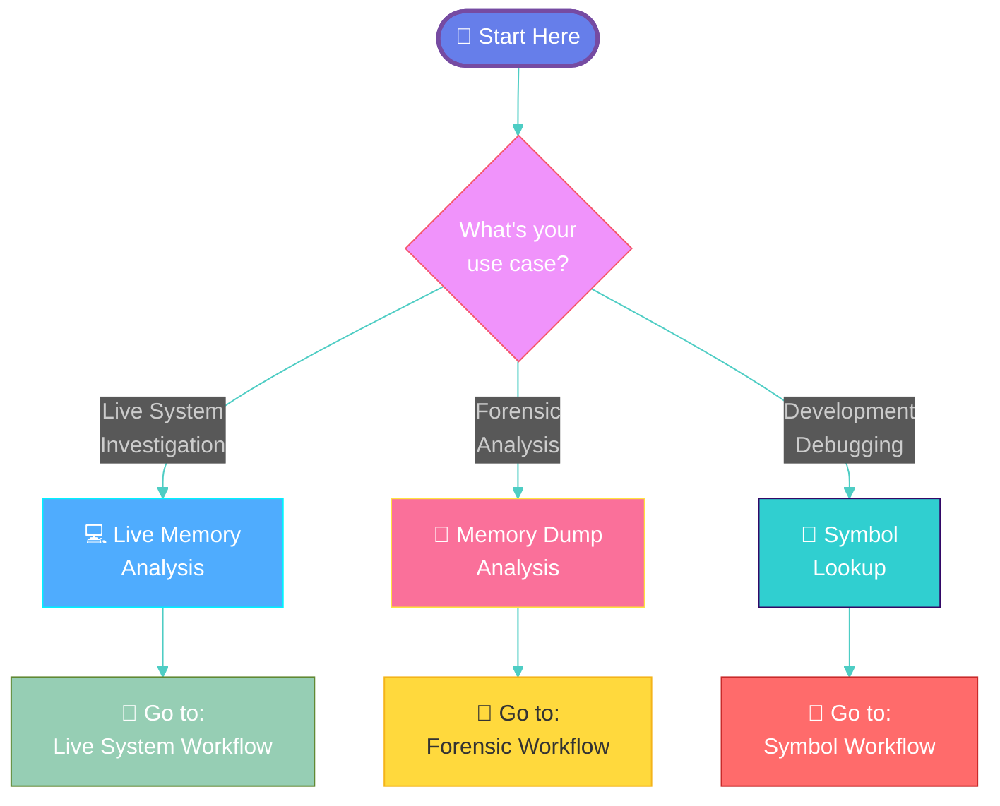
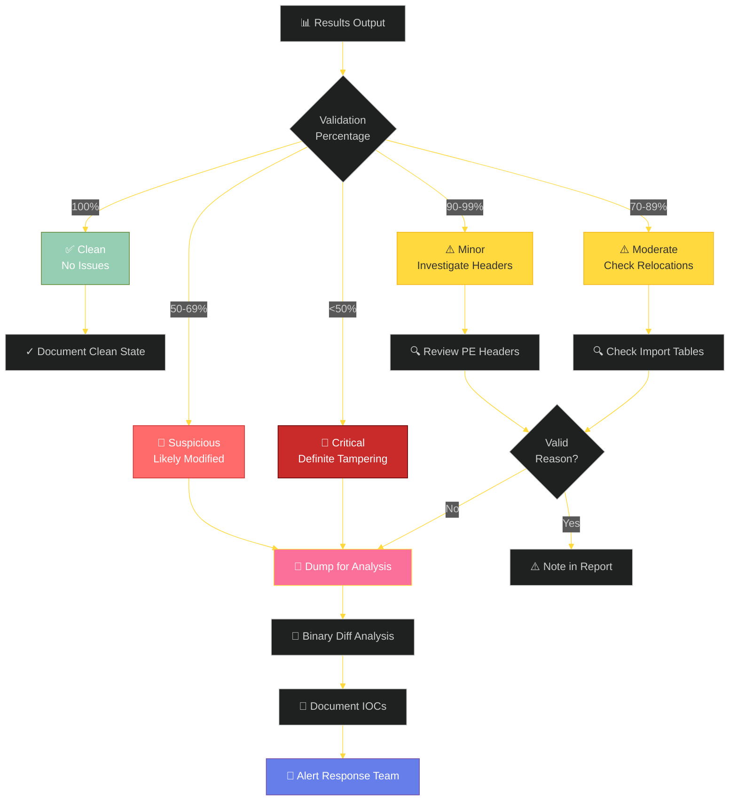
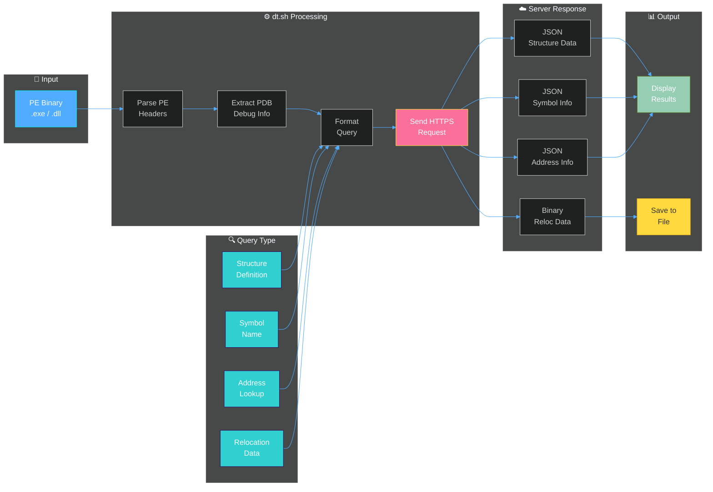
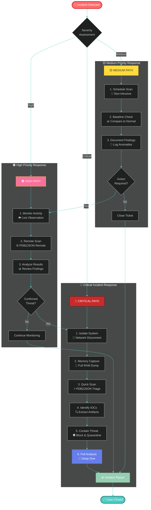
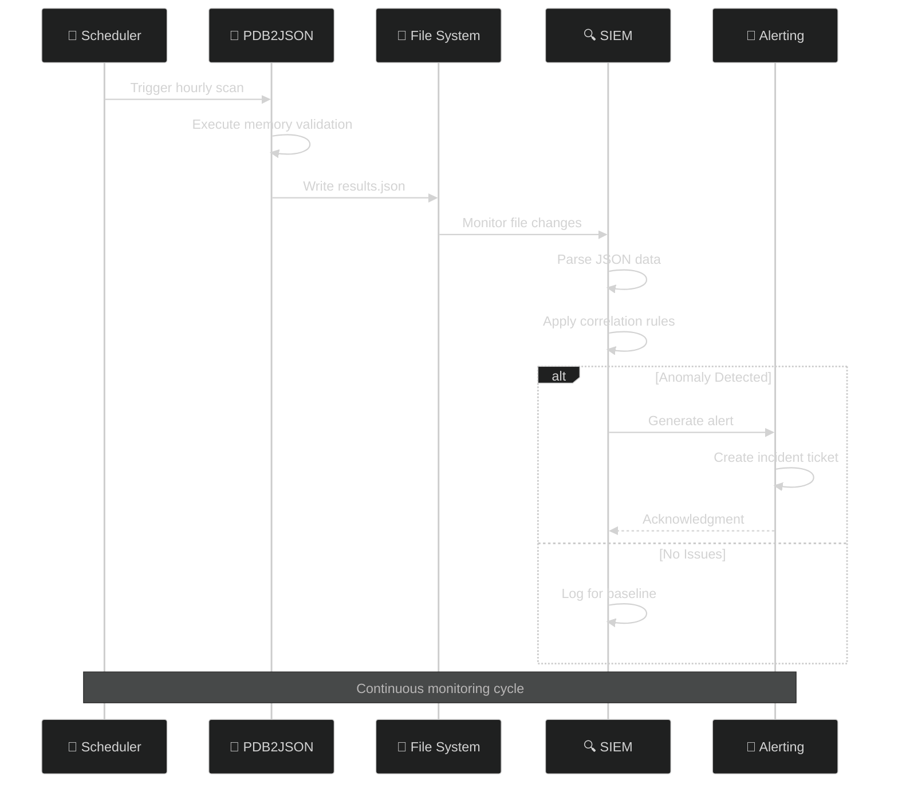
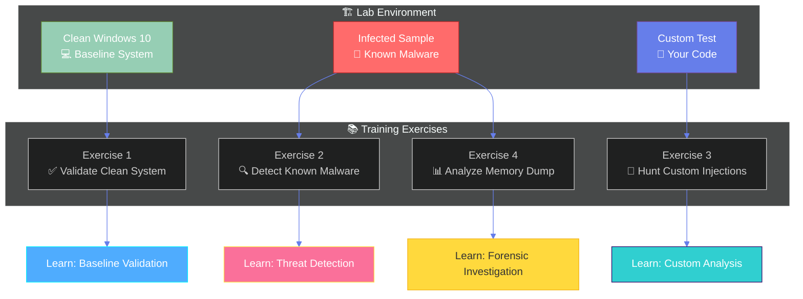

# 🔄 Workflows & Process Guide

<div align="center">

**Your comprehensive guide to memory integrity validation workflows**



</div>

---

## 🎯 Table of Contents

1. [💻 Live Memory Analysis Workflow](#-live-memory-analysis-workflow)
2. [🔬 Forensic Memory Dump Workflow](#-forensic-memory-dump-workflow)
3. [🐛 Symbol Lookup Workflow](#-symbol-lookup-workflow)
4. [🚨 Incident Response Workflow](#-incident-response-workflow)
5. [🔍 Threat Hunting Workflow](#-threat-hunting-workflow)
6. [⚙️ Integration Workflows](#️-integration-workflows)

---

## 💻 Live Memory Analysis Workflow

```mermaid
%%{init: {'theme':'dark', 'themeVariables': { 'primaryColor':'#4facfe','primaryTextColor':'#fff','primaryBorderColor':'#00f2fe','lineColor':'#f093fb','secondaryColor':'#30cfd0','tertiaryColor':'#96ceb4'}}}%%
stateDiagram-v2
    [*] --> Preparation: Start Live Analysis
    
    state Preparation {
        [*] --> VerifyAccess: Check Credentials
        VerifyAccess --> TestConnection: Verify Network
        TestConnection --> InstallModules: Setup PowerShell
        InstallModules --> [*]: Ready
    }
    
    Preparation --> Configuration: Environment Ready
    
    state Configuration {
        [*] --> SetTarget: Define Target Host
        SetTarget --> SetCreds: Configure Credentials
        SetCreds --> SetThreads: Tune Performance
        SetThreads --> SelectProcesses: Optional: Filter Processes
        SelectProcesses --> [*]: Configured
    }
    
    Configuration --> Execution: Launch Scan
    
    state Execution {
        [*] --> Connect: Establish Session
        Connect --> Elevate: Get SYSTEM Token
        Elevate --> EnumProcesses: List All Processes
        EnumProcesses --> ReadMemory: Read Virtual Pages
        ReadMemory --> HashPages: Calculate SHA256
        HashPages --> SendHashes: Transmit to Server
        SendHashes --> ReceiveResults: Get Validation
        ReceiveResults --> [*]: Scan Complete
    }
    
    Execution --> Analysis: Process Results
    
    state Analysis {
        [*] --> ParseResults: Load JSON Data
        ParseResults --> BuildTreeMap: Create Visualization
        BuildTreeMap --> IdentifyAnomalies: Find Issues
        IdentifyAnomalies --> PrioritizeFindings: Rank by Severity
        PrioritizeFindings --> [*]: Analysis Complete
    }
    
    Analysis --> Response: Take Action
    
    state Response {
        [*] --> GenerateReport: Document Findings
        GenerateReport --> InvestigateProcess: Deep Dive Suspicious
        InvestigateProcess --> DumpMemory: Extract Modified Pages
        DumpMemory --> DiffAnalysis: Binary Comparison
        DiffAnalysis --> Remediate: Apply Fixes
        Remediate --> [*]: Resolved
    }
    
    Response --> [*]: Case Closed
    
    note right of Preparation
        ⏱️ Est. Time: 5 minutes
        🔧 Tools: PowerShell, ShowUI
        🔐 Permissions: Admin
    end note
    
    note right of Execution
        ⏱️ Est. Time: 10-30 minutes
        📊 Depends on: System size
        🚀 Parallel: Up to 512 threads
    end note
    
    note right of Analysis
        ⏱️ Est. Time: 5-10 minutes
        🎨 Output: Interactive TreeMap
        🔍 Focus: Low validation %
    end note
```



### 📋 Step-by-Step: Live Memory Analysis

#### 1️⃣ **Preparation Phase** (5 minutes)

```powershell
# Verify PowerShell version (need 5.0+)
$PSVersionTable.PSVersion

# Install required modules
Install-Module ShowUI -Scope CurrentUser

# Verify remote access
Test-WSMan -ComputerName target-host
```

#### 2️⃣ **Configuration Phase** (2 minutes)

```powershell
# Set target parameters
$Target = "192.168.1.100"
$User = "Administrator"
$Pass = "SecurePassword123!"

# Optional: Filter to specific processes
$ProcessFilter = @("chrome.exe", "firefox.exe", "powershell.exe")
```

#### 3️⃣ **Execution Phase** (10-30 minutes)

```powershell
# Run the scan
$Results = .\Test-AllVirtualMemory.ps1 `
    -TargetHost $Target `
    -aUserName $User `
    -aPassWord $Pass `
    -MaxThreads 512 `
    -ElevatePastAdmin `
    -ProcNameGlob $ProcessFilter `
    -GUIOutput
```

#### 4️⃣ **Analysis Phase** (5-10 minutes)

```powershell
# Review suspicious processes (validation < 90%)
$Results.ResultDictionary.Values | 
    Where-Object { $_.PercentValid -lt 90 } |
    Sort-Object PercentValid |
    Format-Table Name, PercentValid, Id

# Examine specific process details
$SuspiciousPID = 1234
$Results.ResultDictionary[$SuspiciousPID].Children |
    Where-Object { $_.PercentValid -lt 100 } |
    Select-Object ModuleName, PercentValid, BaseAddress
```

#### 5️⃣ **Response Phase** (varies)

```powershell
# Generate detailed report
$Results | ConvertTo-Json -Depth 10 | 
    Out-File "incident-$(Get-Date -Format 'yyyyMMdd-HHmmss').json"

# Extract modified memory regions for analysis
# (Details in TreeMap GUI right-click menu)
```

---

## 🔬 Forensic Memory Dump Workflow

```mermaid
%%{init: {'theme':'dark', 'themeVariables': { 'primaryColor':'#fa709a','primaryTextColor':'#fff','primaryBorderColor':'#fee140','lineColor':'#4facfe','secondaryColor':'#30cfd0'}}}%%
journey
    title Forensic Memory Dump Analysis Journey
    section Acquire Image
      Capture memory: 5: Forensic Tool
      Verify integrity: 5: Hash validation
      Transfer to lab: 4: Secure channel
    section Setup Analysis
      Install Volatility: 5: Python pip
      Install plugin: 5: Copy to plugins
      Identify profile: 3: imageinfo
      Verify profile: 4: Run test command
    section Execute Scan
      Load dump: 5: Volatility
      Enumerate processes: 5: Plugin
      Hash memory pages: 4: SHA256
      Send to server: 4: HTTPS
      Receive validation: 5: JSON response
    section Analyze Results
      Review metrics: 5: Terminal output
      Check failures: 4: Log file
      Dump suspicious: 3: Export blocks
      Compare binaries: 4: Diff viewer
    section Report Findings
      Document IOCs: 5: Report tool
      Timeline events: 4: Analysis
      Recommend actions: 5: Security team
```

### 📋 Step-by-Step: Forensic Analysis

#### 1️⃣ **Acquire Memory Image**

```bash
# Using common acquisition tools
# DumpIt, FTK Imager, WinPMEM, etc.

# Verify image integrity
sha256sum memory.raw > memory.raw.sha256
```

#### 2️⃣ **Setup Volatility Environment**

```bash
# Install Volatility and dependencies
pip install -r requirements.txt

# Copy plugin to Volatility plugins directory
cp inVteroJitHash.py /path/to/volatility/plugins/

# Identify memory profile
python vol.py -f memory.raw imageinfo

# Example output:
# Suggested Profile(s): Win10x64_14393, Win10x64_15063
```

#### 3️⃣ **Execute Memory Validation**

```bash
# Basic scan
python vol.py \
    --plugins=/path/to/plugins \
    -f memory.raw \
    --profile=Win10x64_14393 \
    invterojithash

# Advanced scan with extras
python vol.py \
    --plugins=/path/to/plugins \
    -f memory.raw \
    --profile=Win10x64_14393 \
    invterojithash \
    -x \                          # Extra totals per module
    -s \                          # Super verbose
    -D /output/failed-blocks \    # Dump failed validations
    -F incident-failures.txt      # Failure log file
```

#### 4️⃣ **Interpret Results**



---

## 🐛 Symbol Lookup Workflow



### 📋 Common Symbol Lookup Tasks

#### 🔎 **Find Structure Definition**

```bash
# Get _EPROCESS structure
./dt.sh -i /path/to/ntoskrnl.exe -t _EPROCESS

# Get all structures (warning: large output!)
./dt.sh -i /path/to/ntoskrnl.exe -t "*"

# Get specific pool header
./dt.sh -i /path/to/ntoskrnl.exe -t _POOL_HEADER

# Save to file
./dt.sh -i /path/to/ntoskrnl.exe -t _KTHREAD -o kthread.json
```

#### 📝 **Symbol Name Lookup**

```bash
# Find all CreateFile variants
./dt.sh -i /path/to/kernel32.dll -X "CreateFile*"

# Find specific symbol
./dt.sh -i /path/to/ntdll.dll -X "NtQuerySystemInformation"

# Wildcard search
./dt.sh -i /path/to/user32.dll -X "*Window*"
```

#### 📍 **Address Resolution**

```bash
# Resolve symbol at specific RVA
./dt.sh -i /path/to/ntoskrnl.exe -A 0x140001000

# With custom base address
./dt.sh -i /path/to/module.dll -A 0x1400 -b 0x7FF800000000
```

#### 🔄 **Get Relocation Data**

```bash
# Extract relocations for binary reconstruction
./dt.sh -i /path/to/application.exe -r

# Save relocations to file for later use
./dt.sh -i /path/to/library.dll -r -o relocations.bin
```

---

## 🚨 Incident Response Workflow



### ⚡ Rapid Response Checklist

#### Phase 1: Triage (5 minutes)
- [ ] Assess incident severity
- [ ] Identify affected systems
- [ ] Determine business impact
- [ ] Activate response team

#### Phase 2: Containment (15 minutes)
- [ ] Isolate affected systems (if critical)
- [ ] Capture volatile memory
- [ ] Document system state
- [ ] Preserve evidence

#### Phase 3: Analysis (30-60 minutes)
- [ ] Run PDB2JSON memory scan
- [ ] Identify modified processes
- [ ] Extract IOCs
- [ ] Correlate with threat intel

#### Phase 4: Remediation (varies)
- [ ] Remove malicious code
- [ ] Patch vulnerabilities
- [ ] Reset credentials
- [ ] Restore from backup (if needed)

#### Phase 5: Recovery (varies)
- [ ] Verify system integrity
- [ ] Monitor for persistence
- [ ] Document lessons learned
- [ ] Update defenses

---

## 🔍 Threat Hunting Workflow

```mermaid
%%{init: {'theme':'dark', 'themeVariables': { 'primaryColor':'#667eea','primaryTextColor':'#fff','primaryBorderColor':'#764ba2','lineColor':'#f093fb','secondaryColor':'#4facfe'}}}%%
graph LR
    subgraph "1️⃣ Hypothesis"
        A[Define<br/>Hypothesis] --> B[Identify<br/>Indicators]
        B --> C[Plan<br/>Hunt]
    end
    
    subgraph "2️⃣ Collection"
        C --> D[Scan<br/>Endpoints]
        D --> E[Gather<br/>Memory Data]
        E --> F[Collect<br/>Artifacts]
    end
    
    subgraph "3️⃣ Analysis"
        F --> G[Validate<br/>Memory]
        G --> H[Find<br/>Anomalies]
        H --> I[Correlate<br/>Data]
    end
    
    subgraph "4️⃣ Investigation"
        I --> J{Findings?}
        J -->|Positive| K[Deep<br/>Analysis]
        J -->|Negative| L[Refine<br/>Hypothesis]
        L --> A
    end
    
    subgraph "5️⃣ Response"
        K --> M[Document<br/>TTPs]
        M --> N[Create<br/>Detections]
        N --> O[Share<br/>Intel]
    end
    
    O --> P([Hunt Complete])
    
    style A fill:#667eea,stroke:#764ba2,color:#fff
    style D fill:#f093fb,stroke:#f5576c,color:#fff
    style G fill:#4facfe,stroke:#00f2fe,color:#fff
    style K fill:#fa709a,stroke:#fee140,color:#fff
    style M fill:#30cfd0,stroke:#330867,color:#fff
    style P fill:#96ceb4,stroke:#618833,color:#fff
```



### 🎯 Common Hunting Scenarios

#### 🔎 **Hunt for Code Injection**

```powershell
# Hypothesis: Malware using process hollowing or DLL injection
# Target: Browser and system processes

$Results = .\Test-AllVirtualMemory.ps1 `
    -TargetHost $Target `
    -ProcNameGlob @("chrome.exe", "firefox.exe", "explorer.exe", "svchost.exe") `
    -MaxThreads 512

# Look for processes with < 95% validation
$Results.ResultDictionary.Values | 
    Where-Object { $_.PercentValid -lt 95 } |
    Select-Object Name, PercentValid, Id, ModuleName
```

#### 🔎 **Hunt for Memory-Only Malware**

```bash
# Hypothesis: Fileless malware residing only in memory
# Look for unmapped executable regions

python vol.py -f memory.raw --profile=Win10x64 invterojithash -x
# Review output for "Unable to scan anonymous executable memory"
```

#### 🔎 **Hunt for Rootkit Activity**

```powershell
# Hypothesis: Kernel-level rootkit modification
# Scan System process (PID 4)

$Results = .\Test-AllVirtualMemory.ps1 -TargetHost $Target

# Examine System process in detail
$Results.ResultDictionary[4].Children | 
    Where-Object { $_.PercentValid -lt 100 } |
    Format-Table ModuleName, PercentValid, BaseAddress
```

---

## ⚙️ Integration Workflows

### 🔗 SIEM Integration



### 📊 Automation Script Example

```powershell
# Automated daily scan with SIEM integration
$Config = @{
    Targets = @("server01", "server02", "workstation-*")
    OutputPath = "C:\SIEM\Intake\PDB2JSON\"
    Schedule = "0 2 * * *"  # 2 AM daily
    AlertThreshold = 95      # Alert if < 95% validation
}

foreach ($Target in $Config.Targets) {
    $Results = .\Test-AllVirtualMemory.ps1 -TargetHost $Target
    
    # Generate SIEM-friendly output
    $SIEMEvent = @{
        Timestamp = Get-Date -Format "o"
        Source = $env:COMPUTERNAME
        Target = $Target
        TotalProcesses = $Results.ResultDictionary.Count
        SuspiciousCount = ($Results.ResultDictionary.Values | 
            Where-Object { $_.PercentValid -lt $Config.AlertThreshold }).Count
        Details = $Results
    }
    
    # Write to SIEM intake folder
    $OutputFile = Join-Path $Config.OutputPath "scan-$Target-$(Get-Date -Format 'yyyyMMdd-HHmmss').json"
    $SIEMEvent | ConvertTo-Json -Depth 10 | Out-File $OutputFile
}
```

---

## 📚 Workflow Best Practices

### ✅ Do's

✔️ **Document Everything** - Keep detailed logs of all scans and findings  
✔️ **Baseline First** - Establish normal before hunting for abnormal  
✔️ **Automate Routine** - Schedule regular scans for continuous monitoring  
✔️ **Validate Findings** - Always investigate anomalies before taking action  
✔️ **Share Intelligence** - Contribute findings back to the community  

### ❌ Don'ts

❌ **Don't Skip Triage** - Always assess severity before acting  
❌ **Don't Trust 100%** - Even validated systems can have issues  
❌ **Don't Forget Context** - Consider the system's role and normal behavior  
❌ **Don't Ignore Performance** - Monitor system impact during scans  
❌ **Don't Neglect Documentation** - Future you will thank present you  

---

## 🎓 Training Scenarios

### 🎮 Practice Lab Setup



---

## 📖 Additional Resources

- 🏗️ [Architecture Guide](ARCHITECTURE.md)
- 🚀 [Quick Start](QUICKSTART.md)
- 🤝 [Contributing](CONTRIBUTING.md)
- 💡 [Examples](examples/)

---

<div align="center">

**🔄 Workflows that work**

*"Process makes perfect"*

</div>
